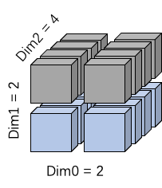
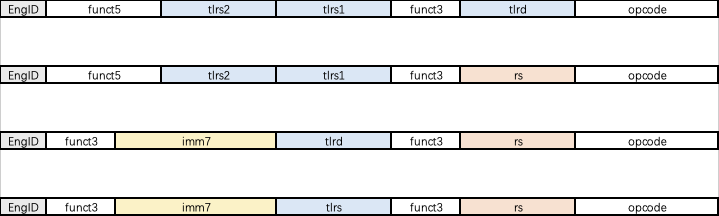

TensorLoad 张量处理指令族

## 1. **概述**
这篇文档是关于 Tensor Reshape 类的指令扩展。这一类指令主要用于与计算无关的张量数据重组。主要应用于 Reshape 类算子的实现。例如：Reshape、Transpose、Im2Col、Compress、Concat 等
这一套指令扩展是将需要进行重排的 tensor 拆分成多个三维 block（对应一个架构寄存器），指令通过对 block 的操作，从而实现对整个 tensor 的数据重排。

   - 支持多种张量操作：
     - TL.XPOSE：4 维张量任意两个维度的交换
     - TL.CONCAT：3 维张量按指定维度进行有效位拼接
     - TL.MERGE：3 维张量按指定维度进行有效位融合
     - TL.ADDI：张量元素级立即数加法运算
     - TL.MLOAD：按最高维度掩码条件载入数据
     - TL.MSTORE：按最高维度掩码条件存储数据
   - 原地操作：source reg 和 destination reg 相同（TL.XPOSE）
   - 立即数支持：TL.ADDI 支持 12 位有符号立即数
   - 内存访问：TL.MLOAD/TL.MSTORE 支持条件化内存操作

## 2. **编程模型**
### 2.1 自定义 CSR 
这一套指令扩展增加了若干个 CSR。CSR 的基本信息如下表所示

| Address | Name | Description |
|---------|---------|---------|
| TBD  | ttype  | 用于描述三维 block 的数据类型  |
| TBD  | tshape  | 用于描述三维 block 的形状大小  |                  
| TBD  | tmask_ls  | 用于辅助 load/store 指令的实现  |
| TBD  | tmask_concat_1  | 用于辅助 concat 指令的实现, 用于指定 tlrs1 中的有效数据  |
| TBD  | tmask_concat_2  | 用于辅助 concat 指令的实现, 用于指定 tlrs2 中的有效数据  |
| TBD  | tmask_load_stride  | 用于辅助 load/store 指令的实现 |
| TBD  | tmask_load_width  | 用于辅助 load/store 指令的实现 |

#### 2.1.1 ttype
| Bits         | Name          | Description                              |
|--------------|---------------|------------------------------------------|
| 31:12        | 0             | Reserved (must be zero).                 |
| 11:10        | tfp32[1:0]    | 32-bit float point enabling.             |
| 9:8          | tfp16[1:0]    | 16-bit float point enabling.             |
| 7:6          | tfp8[1:0]     | 8-bit float point enabling.              |
| 5:4          | tfp4[1:0]     | 4-bit float point enabling.              |
| 3            | tint32        | 32-bit integer enabling.                 |
| 2            | tint16        | 16-bit integer enabling.                 |
| 1            | tint8         | 8-bit integer enabling.                  |
| 0            | tint4         | 4-bit integer enabling.                  |

对于 tint4、tint8、tint16、tint32 字段，如果设置为 1，则表明当前 block 的每个元素的数据类型为：int4、int8、int16、int32

对于 tfp8 字段，如果值为 2'b01，则数据类型为 E4M3；如果值为 2'b10，则数据类型为 E5M2；如果值为 2'b11，则数据类型为 E3M4。若不支持 fp8，则该字段为 2'b00

**后续补充其他浮点数据类型**

#### 2.1.2 tshape
每个 block 为三维 tensor， tshape 用于描述该三维 tensor 的大小。
对于多维度 tensor 的定义与 PyTorch 保持一致。PyTorch 中，Tensor 的维度按索引从 0 开始编号，遵循“左高右低”的原则：
最高维度（Highest Dimension）：索引 0，即最外层的维度（如 (N, H, W, C) 中的 N 维度）。
最低维度（Lowest Dimension）：最后一个索引（即 dim=-1 或 dim=n-1，其中 n 是总维度数），即最内层的维度（如 (N, H, W, C) 中的 C 维度）。


| Bits         | Name          | Description                              |
|--------------|---------------|------------------------------------------|
| 31:24        | 0             | Reserved (must be zero).                 |
| 23:16        | shape_dim0[7:0]     | 三维 block 的最外层维度的形状                 |
| 15:8         | shape_dim1[7:0]     | 三维 block 的中间维度的形状                 |
| 7:0          | shape_dim2[7:0]     | 三维 block 的最内层维度的形状                 |


#### 2.1.3 tmask_ls
tmask_ls 用于辅助 tl.load 和 tl.store 的执行，并且只能作用于 block 的最外层维度。因此其有效位由 tshape 决定，为 tmask_ls[shape_dim0 -1 : 0]

如图所示，如果当前设置 shape_dim0 = 2，shape_dim1 = 2，shape_dim2 = 4，则 tmask_ls 的有效位为 tmask_ls[1:0]。若 tmask_ls[1:0] = 2'b01，则表明 load/store 的有效数据为图中蓝色部分。



说明：浅色区表示有效切片，深色区表示无效切片；有效位数量由 `shape_dim0` 限定。


#### 2.1.4 tmask_concat_1 / tmask_concat_2
tmask_concat_1/tmask_concat_2 用于辅助 tl.concat 的执行，用于辨明指令中指定维度中哪些数据是有效的。更多细节请参考 4.XX节。

### 2.2 自定义架构寄存器
这一套指令扩展增加了 32 个 TensorLoad 架构寄存器 (TLReg): 每个 tlreg 的大小为 1024 Byte，其中 tl0 为 zero 寄存器，其值恒定为 0。
tlreg中存放的 block 的数据类型及形状信息由ttype和tshape指定。 block 的大小不能超过一个 tlreg 可以表示的范围。 tlreg 的结构如下图所示：


说明：`TLReg` 容量为 1024 Byte，按 `ttype` 和 `tshape` 进行元素解释与维度映射。

tlreg 中存储的是一个三维 block， 其尺寸信息分别为：D0，D1，D2。
则 tlreg 数据排布：
```
    for i in range(D0):
        for j in range(D1):
            for k in range(D2):
                tlreg[i*D1*D2+j*D2+k] = block[i][j][k]
```


## 3. 指令设计
### 3.1 指令格式总览
Tensor Reshape 扩展指令采用 32-bit 指令编码。
指令格式概览如下：
    

### 3.2 Load/Store 指令
#### 3.2.1 TL.LOAD / TL.MLOAD 
   
   指令功能：按block最高维度掩码从内存条件载入数据到TLReg
   
   **指令格式**：
   - [31:30] EngineID = 0b00(TensorLoad) / 0b01(TensorComp) / 0b10(TensorStore) / 0b11(Reshape)
   - [29]    st      = 0b0
   - [28]    tm      = 
   - [17:20] imm8    = 立即数
   - [19:15] tlrd   = 目标TLReg索引 [0-31]
   - [14:12] funct3 = 0b000 (TL.MLOAD)
   - [11:7]  rs     = 内存基地址GPR索引 [0-31]
   - [6:0]   opcode = 0b1011011 (CUSTOM-2)
   
   **掩码载入控制**: 
   TL_LOAD_MASK_CSR：32 位载入掩码寄存器
   - 控制最高维度的切片需要载入的切片
   - 1 = 载入该切片，0 = 跳过该切片
   - 掩码位数有效值由张量最高维度大小确定
  
  **寻址方式**：
   - TL_LOAD_STRIDE_CSR{i}：第 i 个 32 位 Load Stride 寄存器
   - TL_LOAD_WIDTH_CSR：32 位 Load Data Width 寄存器

```
// mtype = int8
for i in range(D0):
  if (load_mask[i] == 1): 
    tlrd[i * load_width +: load_width] = MEM[rs + (load_stride{i} + imm8) * load_width +: load_width];
  else:
    tlrd[i * load_width +: load_width] = 0;

```
   
   
   **汇编语法**：
   
   // 配置csr
   - csrrw x0, TL_LOAD_MASK_CSR,   x10  ; 
   - csrrw x0, TL_LOAD_STRIDE_CSR, x11  ; 
   - csrrw x0, TL_LOAD_WIDTH_CSR,  x12  ; 
   
   // 执行掩码载入
   - tl.mload tlrd, offset(rs1)            ; 从rs1地址按上文所述的寻址方式从 L1M 加载数据到 tlreg

#### 3.2.2 TL.STORE / TL.MSTORE 
   
   指令功能：按block最高维度掩码将TLReg的数据写入 L0M 中
   
   **指令格式**：
   - [31:30] EngineID = 0b00(TensorLoad) / 0b01(TensorComp) / 0b10(TensorStore) / 0b11(Reshape)
   - [29]    st      = 0b1
   - [28]    tm      = 
   - [17:20] imm8    = 立即数
   - [19:15] tlrs    = 目标TLReg索引 [0-31]
   - [14:12] funct3  = 0b010 (TL.MSTORE)
   - [11:7]  rs      = L0M 基地址GPR索引 [0-31]
   - [6:0]   opcode  = 0b1011011 (CUSTOM-2)
   
   
   **掩码存储控制**
   TL_STORE_MASK_CSR：32 位存储掩码寄存器
   - 控制最高维度的哪些切片需要存储
   - 1 = 存储该切片，0 = 跳过该切片
   - 掩码位数由张量最高维度大小确定
   
  **寻址方式**：
   - TL_STORE_STRIDE_CSR{i}：第 i 个 32 位 Store Stride 寄存器
   - TL_STORE_WIDTH_CSR：32 位 Store Data Width 寄存器

```
// mtype = int8
for i in range(D0):
    if (store_mask[i] == 1):
    MEM[rs + (store_stride{i} + imm8) * store_width +: store_width] = tlrs[i * store_width +: store_width];
    else: 
    // skip
```
   
   
   **汇编语法**：
   
   // 配置csr
   - csrrw x0, TL_STORE_MASK_CSR,   x10  ; 
   - csrrw x0, TL_STORE_STRIDE_CSR, x11  ; 
   - csrrw x0, TL_STORE_WIDTH_CSR,  x12  ; 
   
   // 执行掩码载入
   - tl.mstore tlrs, offset(rs1)            ; 从rs1地址按上文所述的寻址方式将数据从 tlreg 写入到 L0M


### 3.3 Arithmetic & Logic 指令
#### 3.3.1 TL.ADDI 指令
   ##### 1. 功能：对TLReg中的每个元素都加上一个12位有符号立即数
   
   ##### 2. 指令格式 (I-type变体)：
   - [31:30] EngineID = 0b00(TensorLoad) / 0b01(TensorComp) / 0b10(TensorStore) / 0b11(Reshape)
   - [29:28] funct2 = 0b00
   - [27:20] imm8   = 立即数
   - [19:15] tlrs   = 源TLReg索引 [0-31]
   - [14:12] funct3 = 0b010 (TL.ADDI)
   - [11:7]  tlrd   = 目标TLReg索引 [0-31]
   - [6:0]   opcode = 0b1011011 (CUSTOM-2)
   
   ##### 3. 立即数编码
   8 位有符号立即数采用二进制补码表示：
   - 正数范围: 0 到 +127 (0x00 到 0x7F)
   - 负数范围: -128 到 -1 (0x80 到 0xFF)
   - 符号扩展: 在运算时扩展为 8 位有符号数进行计算
   
   
   ##### 4. 汇编语法：
   tl.addi tlrd, tlrs, imm     ; rd[i] = saturate(rs1[i] + imm) for all i
   tl.addi tlr1, tlr2, 10      ; t1中每个元素 = t2对应元素 + 10
   tl.addi tlr3, tlr3, -5      ; t3中每个元素 -= 5 (原地操作)


### 3.4 Data Move 指令
#### 3.4.1 TL.CONCAT
##### 1. 功能：对两个形状相同的3维张量按指定维度进行有效位拼接
   
##### 2. 指令格式：
   - [31:30] EngineID   = 0b00(TensorLoad) / 0b01(TensorComp) / 0b10(TensorStore) / 0b11(Reshape)
   - [29:25] funct5     = 维度选择 + 指令标识
   - [24:20] tlrs2      = 源张量2 (TLReg索引[0-31])  
   - [19:15] tlrs1      = 源张量1 (TLReg索引[0-31])
   - [14:12] funct3     = 0b001  (Data Move)
   - [11:7]  tlrd       = 目标张量 (TLReg索引[0-31])
   - [6:0]   opcode     = 0b1011011 (CUSTOM-2)
   
##### 3. funct5字段定义 (用于TL.CONCAT)
   对于funct3=001 (Data Move)，funct5的5位编码如下：
   - [4:2] = 0b000 (TL.CONCAT)
   - [1:0] = concat_dim (拼接维度，2位，范围0-2，因为是3维张量)
   
   示例funct5值：
   - 0b000000 (0x0): 沿维度0拼接
   - 0b000001 (0x1): 沿维度1拼接  
   - 0b000010 (0x2): 沿维度2拼接
   - 0b000011 (0x3): 保留
   
##### 4. 双CSR有效位掩码寄存器
   TL_CONACT_MASK1_CSR (): 32位有效位掩码1 (控制tlrs1)
   TL_CONACT_MASK2_CSR (): 32位有效位掩码2 (控制tlrs2)
   
   掩码位含义：
   - 1 = 该位置的数据有效，参与拼接
   - 0 = 该位置的数据无效，跳过
   
##### 5. 拼接算法：

tlreg 中存储的是一个三维 block， 其尺寸信息分别为：D0，D1，D2。
则 tlreg 数据排布：
```
    for i in range(D0):
        for j in range(D1):
            for k in range(D2):
                tlreg[i*D1*D2+j*D2+k] = block[i][j][k]
```

对于 TL.CONCAT，假设两个 tlrs 的融合维度为 D0，则 tlrd和tlrs1、tlrs2之间的数据关系可以描述为：
```
    i_valid = 0
    for n in range(2):
        for i in range(D0):
            for j in range(D1):
                for k in range(D2):
                    if(tl_concat_mask_{n}[i] == 1):
                        tlrd[i_valid*D1*D2+j*D2+k] = tlrs{n}[i*D1*D2+j*D2+k]
                        i_valid = i_valid + 1
```
   
##### 6. 汇编语法：
   # 设置双掩码
   csrrw x0, TL_MASK1_CSR, x12   ; 设置rs1有效位掩码
   csrrw x0, TL_MASK2_CSR, x13   ; 设置rs2有效位掩码
   
   # 执行有效位拼接
   tl.concat.0 tlr0, tlr1, tlr2        ; 沿维度0拼接 (funct7=0x40)
   tl.concat.1 tlr0, tlr1, tlr2       ; 沿维度1拼接 (funct7=0x41)  
   tl.concat.2 tlr0, tlr1, tlr2       ; 沿维度2拼接 (funct7=0x42)

#### 3.4.2 TL.MERGE
##### 1. 功能：对两个形状相同的3维张量按指定维度进行有效位融合
   
##### 2. 指令格式：
   - [31:30] EngineID   = 0b00(TensorLoad) / 0b01(TensorComp) / 0b10(TensorStore) / 0b11(Reshape)
   - [29:25] funct5     = 维度选择 + 指令标识
   - [24:20] tlrs2      = 源张量2 (TLReg索引[0-31])  
   - [19:15] tlrs1      = 源张量1 (TLReg索引[0-31])
   - [14:12] funct3     = 0b001 (Data Move)
   - [11:7]  tlrd       = 目标张量 (TLReg索引[0-31])
   - [6:0]   opcode     = 0b1011011 (CUSTOM-2)
   
##### 3. funct5字段定义 (用于TL.MERGE)
   对于funct3=001 (Data Move)，funct5的5位编码如下：
   - [4:2] = 0b001 （TL.MERGE）
   - [1:0] = merge_dim (融合维度，2位，范围0-2，因为是3维张量)
   
   示例funct5值：
   - 0b001000 (0x0): 沿维度0融合
   - 0b001001 (0x1): 沿维度1融合  
   - 0b001010 (0x2): 沿维度2融合
   - 0b001011 (0x3): 保留
   
##### 4. CSR有效位掩码寄存器
   TL_CONACT_MASK1_CSR (): 32位有效位掩码1 (控制tlrs1和tlrs2)
   
   掩码位含义：
   - 1 = 该位置的数据来自tlrs1对应位置
   - 0 = 该位置的数据来自tlrs2对应位置
   
##### 5. 融合算法：

tlreg 中存储的是一个三维 block， 其尺寸信息分别为：D0，D1，D2。
则 tlreg 数据排布：
```
    for i in range(D0):
        for j in range(D1):
            for k in range(D2):
                tlreg[i*D1*D2+j*D2+k] = block[i][j][k]
```

对于 TL.MERGE，假设两个 tlrs 的融合维度为 D0，：
```
        for i in range(D0):
            for j in range(D1):
                for k in range(D2):
                    if(tl_concat_mask_{n}[i] == 0):
                        tlrd[i*D1*D2+j*D2+k] = tlrs0[i*D1*D2+j*D2+k]
                    else:
                        tlrd[i*D1*D2+j*D2+k] = tlrs1[i*D1*D2+j*D2+k]
```
   
##### 6. 汇编语法：
   // 设置双掩码
   csrrw x0, TL_MASK1_CSR, x12   ; 设置rs1有效位掩码
   csrrw x0, TL_MASK2_CSR, x13   ; 设置rs2有效位掩码
   
   // 执行有效位拼接
   tl.merge.0 tlr0, tlr1, tlr2        ; 沿维度0拼接 (funct7=0x08)
   tl.merge.1 tlr0, tlr1, tlr2       ; 沿维度1拼接 (funct7=0x09)  
   tl.merge.2 tlr0, tlr1, tlr2       ; 沿维度2拼接 (funct7=0x0a)


### 3.5 Transpose 指令
##### 1. 功能：对两个形状相同的3维张量组成的新张量进行指定维度的交换
   
##### 2. 指令格式：
   - [31:30] EngineID   = 0b00(TensorLoad) / 0b01(TensorComp) / 0b10(TensorStore) / 0b11(Reshape)
   - [29:25] funct5     = 转置维度编码
   - [24:20] tlrs2      = 源张量2 (TLReg索引[0-31])  
   - [19:15] tlrs1      = 源张量1 (TLReg索引[0-31])
   - [14:12] funct3     = 0b011 (TL.XPOSE)
   - [11:7]  rs         = dim_gpr索引 [0-31] (存储维度大小信息的GPR)
   - [6:0]   opcode     = 0b1011011 (CUSTOM-2)


##### 3. GPR维度描述格式
   dim_gpr寄存器的32位布局：
   - [31:24] D3_size = 第3维度大小 (8位，范围1-255)
   - [23:16] D2_size = 第2维度大小 (8位，范围1-255)  
   - [15:8]  D1_size = 第1维度大小 (8位，范围1-255)
   - [7:0]   D0_size = 第0维度大小 (8位，范围1-255)
   
   约束: D0_size × D1_size × D2_size × D3_size = 2048


##### 4. funct5 字段定义 (维度交换 + 指令标识)
   对于 funct3=011 (TL.XPOSE)，funct5 的 5 位编码如下：
   - [4]     = 0b0 (TL.XPOSE 基础标识)
   - [3:2]   = dim1 (第二个交换维度，2位，范围 0-3)
   - [1:0]   = dim0 (第一个交换维度，2位，范围 0-3)
   
   示例funct5值：
   - 0b00001 (0x01): 交换维度0和1 (dim0=0, dim1=1)
   - 0b00010 (0x02): 交换维度0和2 (dim0=0, dim1=2)  
   - 0b00011 (0x03): 交换维度0和3 (dim0=0, dim1=3)
   - 0b01001 (0x09): 交换维度1和2 (dim0=1, dim1=2)
   - 0b01010 (0x0A): 交换维度1和3 (dim0=1, dim1=3)
   - 0b01011 (0x0B): 交换维度2和3 (dim0=2, dim1=3)
   
##### 5. 汇编语法：
   tl.xpose.dim0_dim1 tlreg1, tlreg2, dim_gpr
   
   具体指令变体：
   tl.xpose.01 t1, t2, x10    ; 交换维度0和1 (funct7=0x01)
   tl.xpose.02 t1, t2, x10    ; 交换维度0和2 (funct7=0x02)
   tl.xpose.03 t1, t2, x10    ; 交换维度0和3 (funct7=0x03)
   tl.xpose.12 t1, t2, x10    ; 交换维度1和2 (funct7=0x09)
   tl.xpose.13 t1, t2, x10    ; 交换维度1和3 (funct7=0x0A)
   tl.xpose.23 t1, t2, x10    ; 交换维度2和3 (funct7=0x0B)
   
   示例：
   // 设置x10仅包含维度大小信息
   li x10, 0x02081008      // D3=2, D2=8, D1=16, D0=8
   tl.xpose.01 t1, t2, x10 ; 交换维度0和1: [8,16,8,2] → [16,8,8,2]
   


## 5. 使用示例

### 5.1 简化的基本示例
```
   # 示例1：交换维度0和1，张量形状[8,16,8,2]
   # D0=8, D1=16, D2=8, D3=2
   li x10, 0x02081008        # D3=2, D2=8, D1=16, D0=8
   tl.xpose.01 tl0, tl1, x10   # 执行转置：[8,16,8,2] → [16,8,8,2]
   
   # 示例2：交换维度2和3，张量形状[16,8,8,2]  
   # D0=16, D1=8, D2=8, D3=2
   li x11, 0x02080810        # D3=2, D2=8, D1=8, D0=16
   tl.xpose.23 tl0, tl1, x11   # 执行转置：[16,8,8,2] → [16,8,2,8]
```

### 5.2 有效位拼接示例 (TL.CONCAT)
```   
   # 示例1：最低维度拼接 [8,8,4]
   li x20, 0x0000000C        # mask1: 0011 (位置2,3有效)
   li x21, 0x00000003        # mask2: 1100 (位置0,1有效) 
   csrrw x0, TL_MASK1_CSR, x20 # 设置rs1有效位掩码
   csrrw x0, TL_MASK2_CSR, x21 # 设置rs2有效位掩码
   tl.concat.2 tl10, tl11, tl12   # 沿维度2拼接有效位
   
   # 示例2：沿最高维度稀疏拼接 [8,16,8]
   # 选择rs1的奇数位置和rs2的偶数位置
   li x22, 0x000000AA        # mask1: 奇数位有效 (1010...)
   csrrw x0, TL_MASK1_CSR, x22
   tl.merge.0 tl13, tl14, tl15   # 沿维度0拼接
```

### 5.3 立即数加法示例 (TL.ADDI)
```   
   # 示例1：构建非零 constant pad
   tl.addi tl1, tl0, 50          # t1[i] = saturate(t0[i] + 50) for all i
```   

### 5.4 数据载入示例 (TL.MLOAD)
```   
   # 示例1：稀疏矩阵载入 - 张量形状 [8,32,4]
   # 只载入第0,1,4,5行 (掩码 0b11001100)
   li x11, 0x1000              # 内存基地址
   li x12, 0x000000CC          # 载入掩码: 0b11001100
   csrrw x0, TL_LOAD_MASK_CSR, x12 # 设置载入掩码
   tl.mload tl1, 0(x11)       # 条件载入到t1
   
   # 示例2：矩阵完全载入 - 张量形状 [8,32,4]
   li x14, 0x2000              # 内存基地址
   tl.load t2, x13, x14       # 条件载入到t2
```
### 5.6 掩码存储示例 (TL.MSTORE)
```   
   # 示例1：稀疏结果存储 - 张量形状 [8,32,4]
   # 只存储奇数索引切片 (掩码 0b10101010)
   li x17, 0x3000              # 内存基地址
   li x18, 0x0000AAAA          # 存储掩码: 奇数位
   csrrw x0, TL_STORE_MASK_CSR, x18 # 设置存储掩码
   tl.mstore t3, 0(x17)      # 条件存储t3到内存
   
   # 示例2：矩阵完全存储- 张量形状 [8,32,4]
   # 只存储前4个切片 (掩码 0b00001111)
   li x20, 0x4000              # 内存基地址
   tl.mstore t4, 0(x20)        # 条件存储t4到内存
```

## 6. 异常和错误处理

### 6.1 异常条件
   
   TL.MLOAD (funct3=000):
   - 非法TLReg索引 (>31)
   - 非法GPR索引 (>31)
   - 内存访问越界或对齐错误
   - TL_LOAD_MASK_CSR未初始化
   - 最高维度大小超过32 (掩码位数限制)
   
   TL.MSTORE (funct3=000):
   - 非法TLReg索引 (>31)
   - 非法GPR索引 (>31)
   - 内存访问越界或对齐错误
   - TL_STORE_MASK_CSR未初始化
   - 最高维度大小超过32 (掩码位数限制)

   TL.ADDI (funct3=010):
   - 非法TLReg索引 (>31)
   - 立即数超出范围 (不在-127到+128之间，但硬件应自动截断)
   - 无其他异常条件 (饱和运算不抛出异常)
   
   TL.XPOSE (funct3=011):
   - 非法TLReg索引 (>31)
   - 非法维度索引 (>3)
   - 维度乘积不等于2048
   - dim0 == dim1 (无操作，但不报错)
   - D0不为偶数 (无法均匀分割到两个TLReg)
   
   TL.CONCAT (funct3=001):
   - 非法TLReg索引 (>31)
   - 非法拼接维度 (concat_dim > 2)
   - 3维张量大小超过1024字节
   - 源张量形状不匹配
   - TL_MASK1_CSR或TL_MASK2_CSR未初始化
   - 有效位数量超出目标张量容量
  
   TL.MERGE (funct3=001):
   - 非法TLReg索引 (>31)
   - 非法拼接维度 (merge_dim > 2)
   - 3维张量大小超过1024字节
   - 源张量形状不匹配
   - TL_MASK1_CSR未初始化
   - 有效位数量超出目标张量容量
   


### 6.2 错误处理
   - 维度验证失败：触发非法指令异常
   - 访问越界：触发存储访问异常
   - 正常情况：指令正常完成，无状态更新

## 7. 实现注意事项

### 7.1 性能优化
   - 可以使用硬件加速的数据重排单元
   - 支持流水线操作，提高吞吐量
   - 缓存友好的数据访问模式

### 7.2 硬件要求
   - 需要专用的TLReg寄存器文件
   - 高带宽的数据重排引擎
   - 与通用寄存器文件的高速接口

## 8. 扩展性

### 8.1 未来扩展方向
   - 支持不同数据类型（int16, int32, float32等）
   - 支持更大的张量（多对TLReg组合）
   - 支持更复杂的张量变换（reshape, permute等）

### 8.2 指令变体 (使用CUSTOM-2空间的不同funct7值)
   - TL.XPOSE.W: 32位元素版本 (funct7 = 0b0110010)
   - TL.XPOSE.H: 16位元素版本 (funct7 = 0b0110011)
   - TL.XPOSE.D: 双精度浮点版本 (funct7 = 0b0110100)
   - 基础版本: 8位元素版本 (funct7 = 0b0110001)
